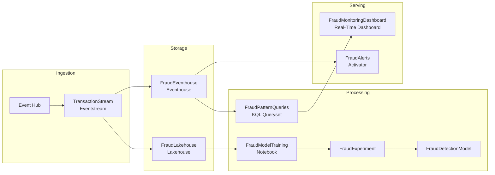

# FraudDetection - Architecture Documentation

> Generated: March 5, 2026  
> Task flow: Lambda (Real-Time Focus)  
> Status: DEPLOYED (Pending Manual Steps)

## Overview

Credit card fraud detection system combining real-time transaction scoring with historical ML model training. The architecture uses a Lambda pattern to deliver sub-second fraud alerts while maintaining comprehensive historical data for continuous model improvement.

## Quick Links

| Document | Description |
| -------- | ----------- |
| [Architecture](architecture.md) | System diagram and item relationships |
| [Deployment Log](deployment-log.md) | What was deployed and how |
| [Deployments](../deployments/) | Scripts, notebooks, and queries |

### Decision Records

| ADR | Decision | Outcome |
| --- | -------- | ------- |
| [001-task-flow](decisions/001-task-flow.md) | Which task flow pattern? | Lambda |
| [002-storage](decisions/002-storage.md) | Storage layer | Eventhouse + Lakehouse (dual) |
| [003-ingestion](decisions/003-ingestion.md) | Ingestion approach | Eventstream (real-time) |
| [004-processing](decisions/004-processing.md) | Processing/transformation | Notebook + KQL Queryset |
| [005-visualization](decisions/005-visualization.md) | Visualization | Real-Time Dashboard |

## Architecture Diagram

## Validation Summary

| Phase | Status |
| ----- | ------ |
| Foundation | ✅ Items created |
| Environment | ⚠️ Needs publish |
| Ingestion | ⚠️ Needs configuration |
| Transformation | ✅ Notebooks bound |
| Visualization | ⚠️ Needs tiles |

## Future Considerations

1. **Model versioning** - Implement MLflow tracking for A/B testing between model versions
2. **Eventstream scaling** - Monitor throughput and add partitions if transaction volume increases
3. **KQL query optimization** - Create materialized views for high-frequency dashboard queries
4. **Activator tuning** - Adjust fraud_score threshold based on false positive/negative rates
