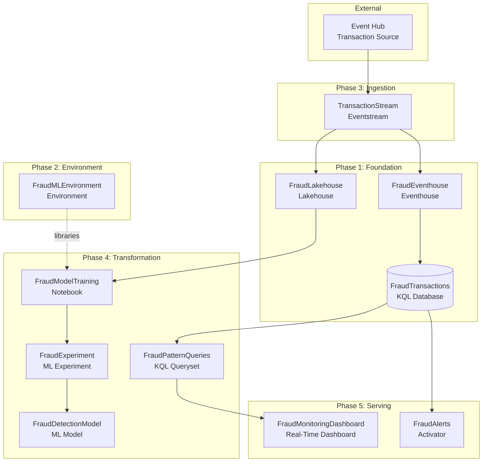

# Architecture

## System Diagram



## Items

| Item | Type | Purpose | Dependencies |
| ---- | ---- | ------- | ------------ |
| FraudEventhouse | Eventhouse | Real-time transaction store | None |
| FraudTransactions | KQL Database | Time-series transaction data | FraudEventhouse |
| FraudLakehouse | Lakehouse | Historical data for ML training | None |
| FraudMLEnvironment | Environment | Python/Spark libraries | None |
| TransactionStream | Eventstream | Real-time ingestion from Event Hub | FraudEventhouse, FraudLakehouse |
| FraudModelTraining | Notebook | ML model training code | FraudLakehouse, FraudMLEnvironment |
| FraudExperiment | ML Experiment | Track model versions | FraudModelTraining |
| FraudDetectionModel | ML Model | Registered production model | FraudExperiment |
| FraudPatternQueries | KQL Queryset | Real-time fraud detection queries | FraudTransactions |
| FraudAlerts | Activator | Automated fraud notifications | FraudTransactions |
| FraudMonitoringDashboard | Real-Time Dashboard | Operations monitoring | FraudPatternQueries |

## Data Flow

### Speed Layer (Real-Time Path)

```
Event Hub → Eventstream → Eventhouse → KQL Queryset → Real-Time Dashboard
                                    ↓
                              Activator → Alerts
```

1. Transactions arrive from payment processors via Event Hub
2. Eventstream ingests and routes to Eventhouse with ML scoring transformation
3. KQL Queryset runs pattern detection queries against time-windowed data
4. Real-Time Dashboard displays live metrics (30-second refresh)
5. Activator triggers alerts when fraud_score exceeds threshold (0.85)

### Batch Layer (Historical Path)

```
Eventstream → Lakehouse → Notebook → Experiment → ML Model
```

1. Eventstream routes transaction copies to Lakehouse
2. Notebook (with Environment) runs feature engineering and model training
3. Experiments track model versions with MLflow
4. Best model registered as FraudDetectionModel for serving

## Configuration Summary

| Item | Configuration | Rationale |
| ---- | ------------- | --------- |
| FraudTransactions | 30-day retention | Balance storage cost with historical query needs |
| FraudMLEnvironment | scikit-learn, xgboost, mlflow, pandas | Standard ML libraries for fraud detection models |
| TransactionStream | Event Hub source, dual destination | Single ingestion point for both speed and batch layers |
| FraudModelTraining | Bound to Lakehouse + Environment | Access historical data with ML libraries |
| FraudMonitoringDashboard | 30-second auto-refresh | Near-real-time ops visibility without excessive load |
| FraudAlerts | fraud_score > 0.85 threshold | Industry-standard high-confidence fraud trigger |
